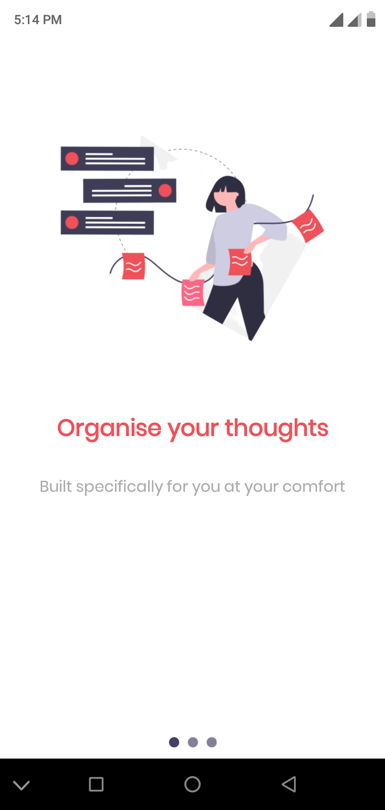
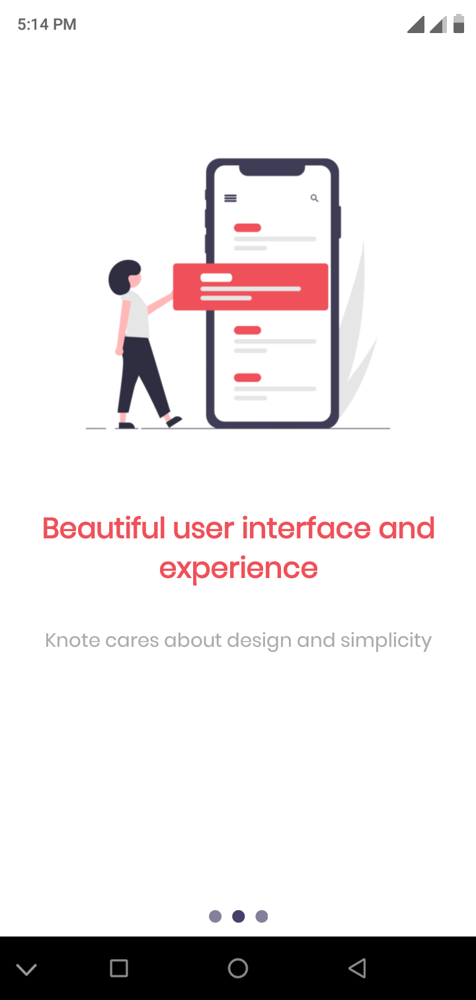
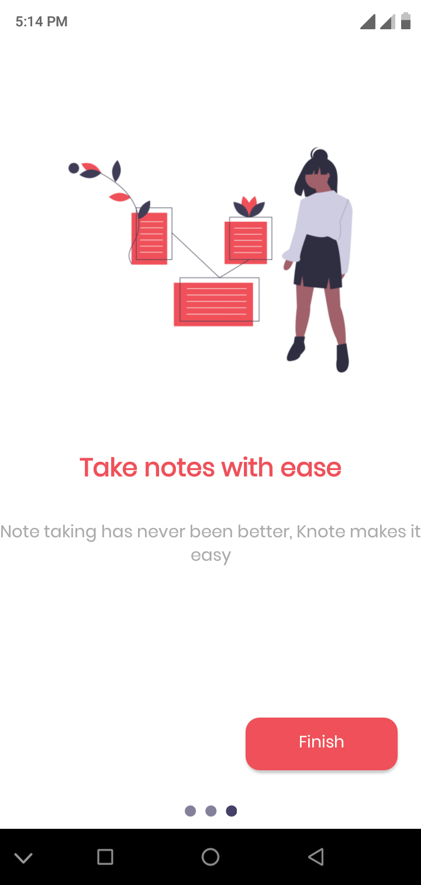
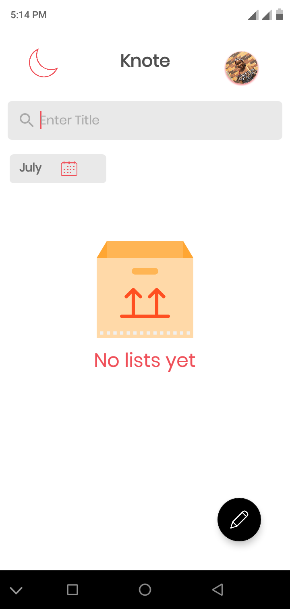
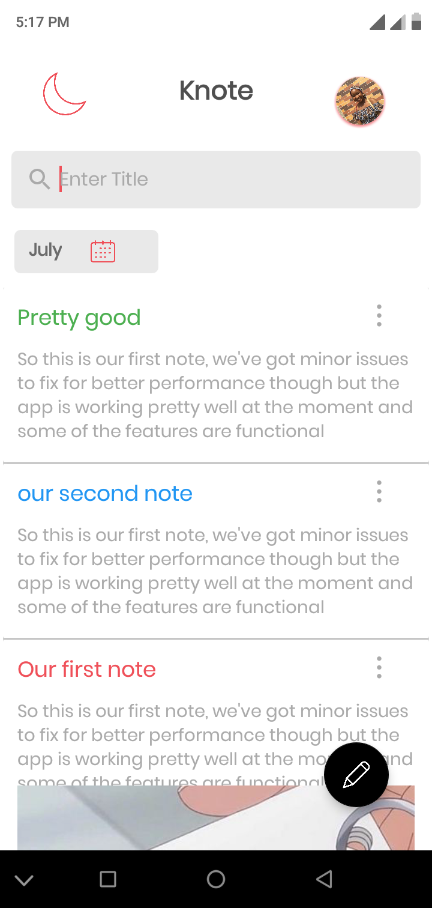
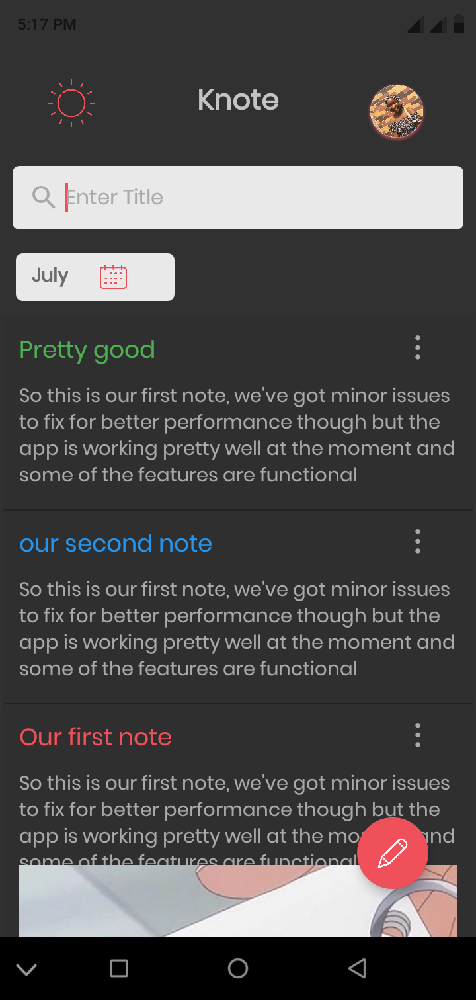

# Knote

Knote is a standard note taking app with Mvvm architecture

### Features 

- Adding an image to note
- Using google text to speech for quick note taking
- Recording voice notes
- Adding web links
- Using OCR for quick note taking

### Tools i will be using are

1. Android studio
2. Git

### Libraries and thirdparties

- Room db
- Coil
- LiveData
- Google mobile vision
- Google text to speech
- Koin
- Coroutines

Intro slide one | Intro slide two | Intro slide three | empty list 
--- | --- | --- | ---
 |  |  | 

<h3 align="center">⚪⚫ Light and Dark themes</h3> 

 
 

 
 
 
 

### Todos

 - Write More Tests
 - Improve Performance

License
----

MIT

**Free Software, Hell Yeah!**
